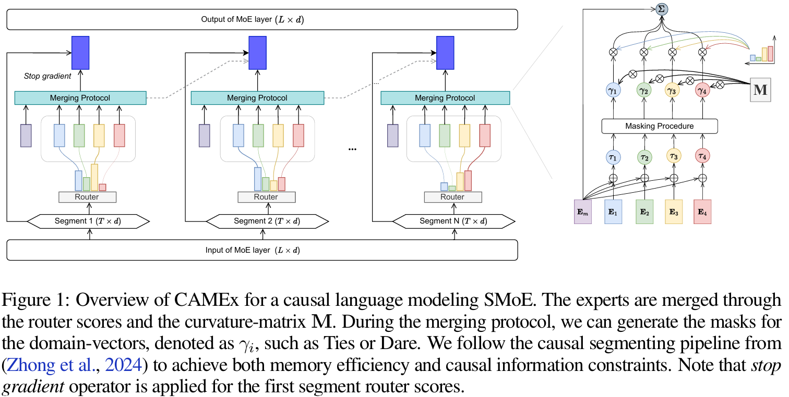

# CAMEx: Curvature-aware Merging of Experts
The source code of "CAMEx: Curvature-aware Merging of Experts":

    

## Requirements
- torch>=1.13.1

## Usage

Run GPT-2 on Wikitext for language modeling: 

`tasks/language-modeling/run_clm.sh`; 

Run T5 on GLUE for text classification: 

`tasks/text-classification/run_glue.sh`; 

Run T5 for question-answering on SQUaD dataset: 

`tasks/question-answering/run_seq2seq_squad.sh`; 

Run T5 for question-answering on WikiQA dataset: 

`tasks/question-answering/run_seq2seq_wikiqa.sh`; 